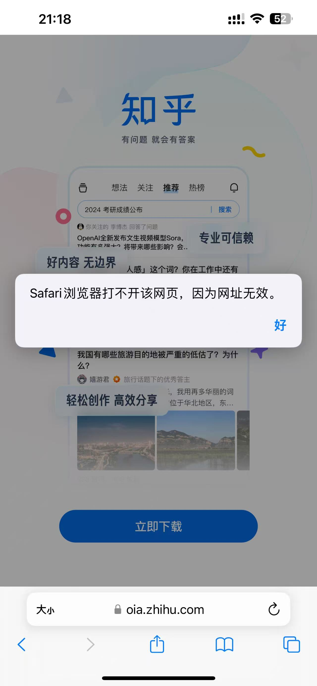
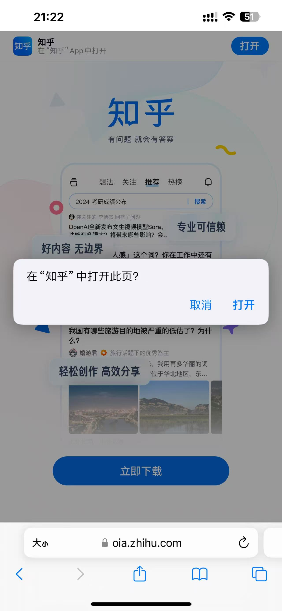

# App 安装检测与跳转

## 功能概述

当目标 App 已安装时直接打开，未安装则跳转到应用商店下载页面。

## 具体实现

```javascript
/**
 * 检测应用是否安装并执行相应跳转
 * @param {string} deepLink - 应用的深度链接（URL Scheme）
 * @param {string} fallbackUrl - 应用商店下载链接
 * @param {number} [timeout=2000] - 超时时间（毫秒）
 */
function checkAppInstalled(deepLink, fallbackUrl, timeout = 2000) {
    let timer;
    let appLaunched = false;

    // 监听页面状态变化以确认应用已启动
    const cleanup = () => {
        appLaunched = true;
        clearTimeout(timer);
        window.removeEventListener('pagehide', cleanup);
        window.removeEventListener('blur', cleanup);
    };

    window.addEventListener('pagehide', cleanup);
    window.addEventListener('blur', cleanup);

    // 尝试通过iframe触发应用跳转
    const iframe = document.createElement('iframe');
    iframe.style.display = 'none';
    iframe.src = deepLink;
    document.body.appendChild(iframe);
    setTimeout(() => document.body.removeChild(iframe), 100);

    // 设置超时回退
    timer = setTimeout(() => {
        if (!appLaunched) {
            window.location.href = fallbackUrl;
        }
    }, timeout);
}

// 使用示例：绑定到按钮点击事件
document.getElementById('openAppBtn').addEventListener('click', () => {
    checkAppInstalled('weixin://', 'https://weixin.qq.com/download');
});
```

## 浏览器兼容性说明

1. **iOS Safari (17+，可能更早)**：
    - 允许 URL Scheme 跳转
    - 会拦截 iframe 跳转方式

2. **微信浏览器（严格）**：
    - 会拦截 URL Scheme 跳转（但允许跳转到应用商店，如 `itms-apps://`）

3. **其他浏览器**：
    - 实现效果因浏览器策略而异。比如自己的 app 内部浏览器可以允许 iframe 跳转

## 知乎的跳转实现方案

知乎在移动端浏览器采用了直接通过 `location.href` 执行URL Scheme跳转的技术方案，这种实现方式无需用户主动点击即可触发应用跳转行为。

### 跳转效果展示

**应用未安装场景**
{width=300}

**应用已安装场景**
{width=300}
