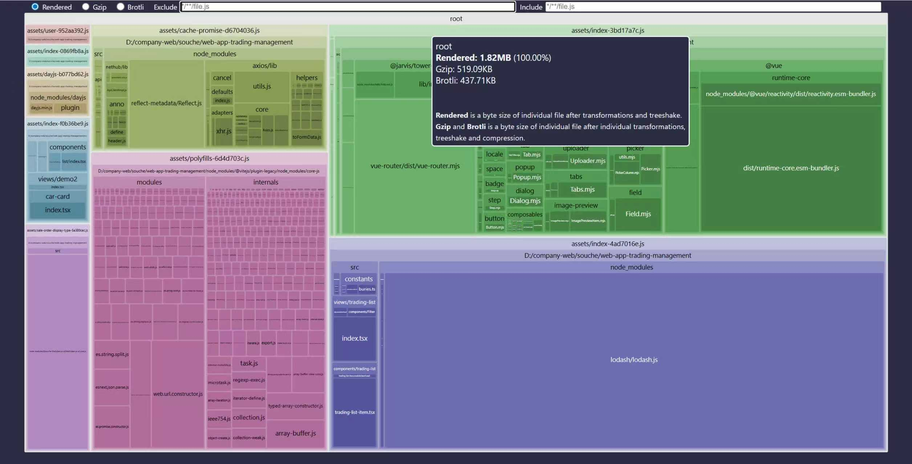
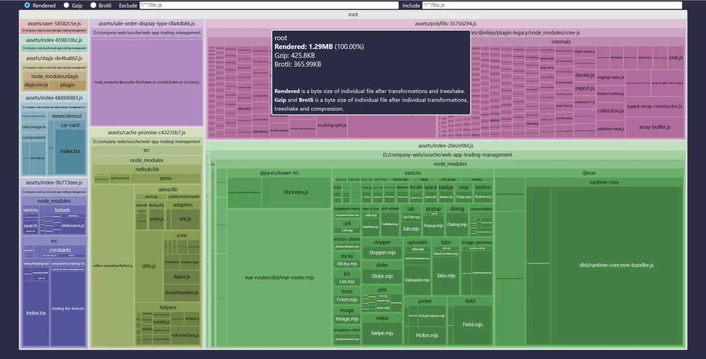
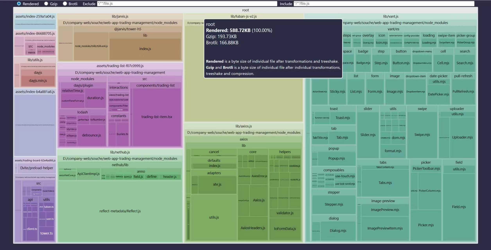
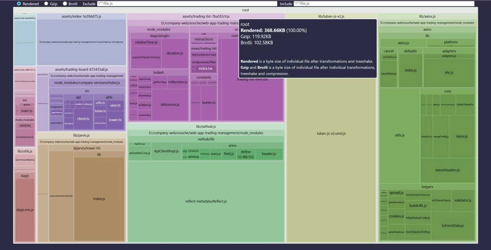

# 项目构建优化：使用 Rollup 可视化分析工具

## 工具配置与使用

### 安装与配置

推荐使用 `rollup-plugin-visualizer` 进行打包结果分析：

```shell
npm install --save-dev rollup-plugin-visualizer
```

Vite 配置示例：

```javascript
import { defineConfig } from 'vite'
import visualizer from 'rollup-plugin-visualizer'

export default defineConfig({
  plugins: [
    // ...其他插件
    visualizer({
      open: true,       // 自动在浏览器中打开报告
      gzipSize: true,  // 显示gzip压缩后大小
      brotliSize: true, // 显示brotli压缩后大小
      filename: "bundle-stats.html" // 分析报告文件名
    })
  ],
})
```

执行构建命令后，将生成可视化报告文件，便于直观分析包体积构成。

:::warning 注意
报告文件可能忽略部分资源（如字体文件），需结合浏览器网络面板综合分析
:::

## 优化性能指标参考

### 1. 未压缩资源标准

- **JavaScript 资源**
    - 关键路径资源：≤ 100 KB（主包、首屏依赖）
    - 非关键资源：≤ 300 KB（建议代码拆分）
    - 警告阈值：> 500 KB（可能导致主线程阻塞）

- **CSS 资源**
    - 首屏CSS：≤ 50 KB（推荐内联关键CSS）
    - 总CSS体积：≤ 100 KB（建议按需加载）

- **静态资源**
    - 优先使用WebP/AVIF替代PNG/JPG
    - 字体推荐WOFF2格式

### 2. 压缩后标准（Gzip/Brotli）

- **首屏总资源**：≤ 100 KB（目标3G网络下3秒可交互）
- 关键JS压缩后：≤ 30 KB
- 非关键JS压缩后：≤ 100 KB
- Brotli压缩通常比Gzip小10-20%，推荐优先采用

## 优化实践案例

### 初始状态分析 ROOT _1.82MB_


### 优化步骤1：按需引入 _1.29MB_

**问题发现**：lodash全量打包

**解决方案**：
1. 新项目推荐使用`lodash-es`（原生支持ES模块）
2. 直接引用子路径（如`lodash/debounce`）
3. 使用babel插件转换按需引入



### 优化步骤2：代码分割 _588KB_

**改进措施**：
- 为路由chunk添加语义化命名（如`[name]-[hash].js`）
- 提取公共库到`lib/`目录
- 按依赖顺序提取公共模块
- 实现路由级代码分割



### 优化步骤3：CDN引入 _368KB_

**问题发现**：vant组件引用数量不多，组件库被全量引入

**解决方案**：
- 使用CDN外部化引入
- 推荐插件：
    - `vite-plugin-cdn-import`
    - `rollup-plugin-external-globals`

:::tip 提示
`rollup-plugin-external-globals` 可以解决 Uncaught TypeError: Failed to resolve module specifier "vue" 错误，是因为它解决了浏览器原生 ES 模块（ESM）与 Rollup 打包之间的模块解析差异问题。

```js
// 转换前（源代码）
import Vue from 'vue';

// 转换后（输出代码）
const Vue = window.Vue; // 直接使用全局变量
```
:::



### 最终结果 ROOT 368.66KB

368.66 KB 相比于 1.82 MB 优化了约 1495.02 KB（80.22%）。