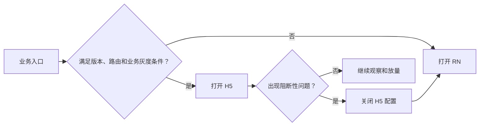

# App 业务从 RN 灰度迁移到 H5

## 迁移不是一次路由替换

原有业务运行在 React Native 中，随着模块增加，开发效率和维护成本逐渐成为问题。迁移目标是把业务分阶段转移到 H5，但迁移期间新旧页面必须同时在线，出现问题时还要能立即切回 RN。

这意味着真正需要解决的不是“如何开发一个 H5 页面”，而是三个过渡期问题：

- 同一个业务入口应该打开 RN 还是 H5？
- 新旧页面并存时，接口数据如何保持兼容？
- H5 上游如何继续调用尚未迁移的 RN 下游页面？

## 用配置控制页面落点

迁移以项目或具体路由为单位，通过配置平台控制哪些用户进入 H5。配置同时受到两类条件约束：

- 客户端能力：仅 App 版本不低于 5.9.0 时启用 H5 页面。
- 业务范围：可以按集团、店铺、门店或用户逐步放量。



路由维度决定迁移哪一块业务，集团、店铺、门店和用户维度则控制影响范围。两者分开后，同一路由可以先对内部用户开放，再逐步扩大到少量店铺和集团。

这里所说的“一键回滚”不是重新发布旧代码，而是通过配置把入口重新指向仍然在线的 RN 页面。它能够快速止损，但前提也很明确：灰度期间不能提前移除旧页面及其依赖。

## 新旧页面必须共享兼容的数据边界

新订单列表开始调用新 API 后，RN 和 H5 会在一段时间内同时访问订单数据。后端因此需要按新旧调用方差异化返回数据，不能在 H5 上线后立即废弃旧页面依赖的字段和结构。

这个问题本质上不是接口选型，而是发布节奏不一致：

```text
H5 页面发布
    ≠ 用户立即全部切换
    ≠ 旧 RN 页面立即下线
    ≠ 旧数据结构可以立即删除
```

只有当灰度结束、回滚窗口关闭，并确认所有入口都不再落到 RN 后，旧接口和兼容逻辑才具备清理条件。

## 跨栈传参暴露了迁移边界

迁移没有按照完整业务链一次完成。部分上游页面已经变成 H5，下游页面仍然由 RN 实现，调用链因此变成：

```text
H5 → Native → RN
```

字符串、数字等可序列化数据可以跨越这条链路，但原 RN 页面之间传递的 `function` 无法直接从 H5 穿过 Native 再交给 RN。若下游页面仍依赖原上游实例提供的函数参数，仅扩展普通参数协议并不能解决问题。

项目在过渡期保留并构建原 RN 上游实例，让未迁移的 RN 下游继续从该实例获取所需参数。H5 负责触发导航，原有 RN 调用关系则暂时保留：

```text
H5 ──触发导航──> Native ──打开──> RN 下游
                                  ↑
                           原 RN 上游实例
                           提供原有参数
```

这是一种迁移期兼容方案，不是长期通信架构。它避免了为了迁移一个上游页面而同时重写所有 RN 下游，但也保留了隐式实例依赖；只有下游完成迁移后，这层兼容才能被移除。

## 放量与回滚如何配合

实际放量沿用逐步扩大影响范围的方式：

1. 内部测试，先验证基础链路。
2. 选择少量店铺或集团，观察 1～2 天。
3. 扩展到规模更大的店铺或集团，并延长观察时间。
4. 全量开启后继续观察 24 小时，再人工确认迁移完成。

观察重点包括接口报错率、页面加载时间和关键操作埋点。出现核心模块错误或操作路径阻断时，通过配置切回 RN；明确且影响较小的样式问题则采用热修复，不必打断整个灰度过程。

阶段推进依赖观察窗口和人工确认。配置平台解决的是切换速度，而不是替代发布决策。

## 这次迁移真正留下了什么

RN 到 H5 的渐进迁移可以拆成两条相互独立的控制线：

- 流量控制：版本门槛、路由开关、业务范围和配置回滚。
- 兼容控制：新旧数据结构共存，以及未迁移 RN 调用链的临时保留。

只完成 H5 页面并不代表迁移完成。入口仍可能回到 RN，接口仍要支持旧数据，下游仍可能依赖 RN 实例。只有灰度、回滚和跨栈兼容都退出后，旧代码才真正具备删除条件。
