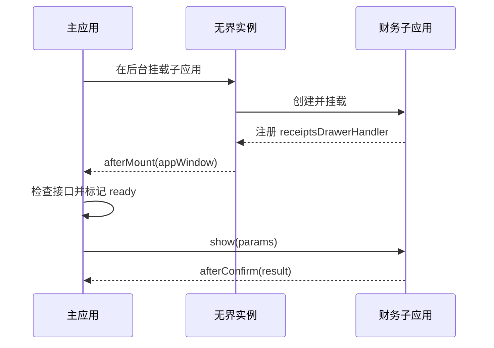

# 无界弹窗方案

## 需求背景

项目基于 [无界](https://wujie-micro.github.io/doc/guide/start.html) 微前端搭建，主应用和子应用均采用 React 与 Ant Design。收款抽屉及其业务逻辑属于财务子应用，但主应用中的订单等业务页面也需要直接发起收款，不能要求用户先跳转到财务子应用。

因此，需要在不复制业务代码、不把财务领域逻辑耦合进主应用的前提下，让主应用直接唤起由子应用维护的收款抽屉，并完成参数传递和结果回调；同时，子应用仍需保持独立运行和调试能力。

## 方案选择

主应用通过无界在后台挂载财务子应用，并在实例挂载完成后获取其运行窗口；子应用则对外暴露统一的弹窗控制方法。主应用由此可以像调用本地组件一样打开或关闭收款抽屉、传入业务参数并监听确认结果。

## 核心问题

### 弹窗如何跨越应用边界？

无界将子应用 JavaScript 运行在 iframe 中，同时把 DOM 渲染到主应用容器下的 Web Component。对子应用 `document.body` 的插入操作会被代理到 Web Component，因此 Ant Design 弹窗不受 iframe 视口限制。

需要注意的是，降级模式会直接使用 iframe 渲染，此时弹窗仍然无法覆盖整个应用。

### 如何判断子应用可以调用？

子应用加载和接口注册都是异步过程。主应用需要通过 `afterMount` 获取子应用窗口，并确认弹窗接口已经注册；就绪之前，入口应保持加载或禁用状态，避免调用不存在的方法。

### 多个弹窗的层级如何管理？

主应用和子应用的弹窗可能同时出现，需要约定统一的层级范围，不能各自沿用组件库的默认值。子应用弹窗的 `z-index` 应高于页面内容，并明确它与主应用确认框、全局通知等浮层的优先级关系。

### 跨应用接口应该暴露什么？

只暴露稳定的业务能力，不向主应用泄漏子应用组件实例。当前场景只需要 `show`、`hide` 和确认回调，后续扩展也应继续遵守同一接口边界。

## 调用流程



## 核心实现

先定义主、子应用共同遵守的最小接口：

```ts
interface ReceiptsDrawerHandler {
  show: (params: ReceiptParams) => void
  hide: () => void
  afterConfirm: (callback: (result: ReceiptResult) => void) => void
}

declare global {
  interface Window {
    receiptsDrawerHandler?: ReceiptsDrawerHandler
  }
}
```

子应用在初始化时注册接口，并在卸载时清理：

```ts
window.receiptsDrawerHandler = {
  show,
  hide,
  afterConfirm,
}

export function cleanupReceiptsDrawer() {
  delete window.receiptsDrawerHandler
}
```

主应用通过无界生命周期获取子应用窗口。业务入口只依赖 `ready` 和约定好的接口，不感知弹窗内部实现：

```tsx
let financeWindow: Window | undefined
;<WujieReact
  name="finance"
  url={financeUrl}
  afterMount={appWindow => {
    financeWindow = appWindow
    setReady(Boolean(appWindow.receiptsDrawerHandler))
  }}
/>

function openReceiptsDrawer(params: ReceiptParams) {
  if (!ready) return

  financeWindow?.receiptsDrawerHandler?.afterConfirm(handleConfirm)
  financeWindow?.receiptsDrawerHandler?.show(params)
}
```

实现的关键不在于代码量，而在于保持边界清晰：子应用负责业务和 UI，主应用负责实例生命周期与调用时机，双方只通过稳定接口协作。
