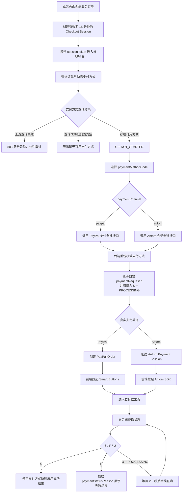

# 从页面内支付到统一收银台：我如何拆分 S、F、U 与支付阶段

## 统一收银台真正要解决的不只是复用

HugeAuto 的车辆检测业务最初在业务页面内完成支付：创建检测订单后，页面继续处理支付方式、第三方 SDK 和支付结果。

接入 PayPal 和 Antom 后，业务页面既要知道用户购买了什么，又要知道不同渠道如何创建支付、如何加载 SDK、如何解释回调。支付能力与检测业务直接耦合，不利于后续扩展到其他订单场景。

因此我直接从职责拆分出发建设统一收银台：业务页面只负责创建业务订单，后端签发 Checkout Session，收银台负责选择支付方式与拉起渠道，结果页负责确认最终状态。

设计状态模型时，我发现只用 `S/F/U` 仍然存在一个关键歧义：同样是 `U`，用户可能还没有点击支付，也可能已经拉起渠道、正在等待异步结果。这两种状态显然不能执行同一种操作。

## 整体流程从 U 的两个阶段展开

整体设计使用 `S/F/U` 作为支付主状态，同时通过 `paymentStatusPhase` 细分 `U`：



状态模型将“状态”和“阶段”分开：`S/F/U` 表达支付主状态，`paymentStatusPhase` 表达 `U` 当前所处的阶段。

## S、F、U 分别需要什么辅助字段

完整的状态组合如下：

| `paymentStatus` | `paymentStatusPhase` | `paymentStatusReason` | 含义                         | 页面行为                           |
| --------------- | -------------------- | --------------------- | ---------------------------- | ---------------------------------- |
| `U`             | `NOT_STARTED`        | `null`                | Unpaid，尚未创建支付         | 展示收银台，允许选择方式并创建支付 |
| `U`             | `PROCESSING`         | `null`                | 已创建支付，渠道结果尚未确定 | 进入结果页并轮询                   |
| `S`             | `null`               | `null`                | 支付成功                     | 展示成功结果并进入订单进度         |
| `F`             | `null`               | `DECLINED` 等         | 支付失败                     | 根据失败原因展示结果与后续操作     |

这里有三条约束很重要：

- `U` 是 `Unpaid`，不是 `Processing`；`PROCESSING` 只是 `U` 下的一个阶段。
- `paymentStatusPhase` 只细分 `U`，在 `S/F` 时必须为 `null`。
- `paymentStatusReason` 只解释 `F`，不能用 `NOT_STARTED` 或 `PROCESSING` 填充。

`S` 是明确的支付终态，不需要继续拆分。如果后续需要描述授权、请款、结算或退款进度，应该增加对应领域的字段，而不是继续复用 `paymentStatusPhase`。

## U + NOT_STARTED 才能创建支付

创建业务订单后，后端会生成有效期为 15 分钟的 Checkout Session。前端只携带 `sessionToken` 进入收银台，再从后端取得金额、订单摘要、主状态和支付阶段。

只有 `U + NOT_STARTED` 可以创建支付。`U + PROCESSING` 说明已经存在支付请求，页面必须进入结果页，不能再次创建渠道订单。`S` 和 `F` 也直接进入各自结果页。

Session 到期后，接口返回 `410 CHECKOUT_SESSION_EXPIRED`，页面按 `F + EXPIRED` 展示。前端不使用本地倒计时决定 Session 是否有效，因为系统时间、页面休眠和重新打开链接都可能使本地判断失真；15 分钟有效期始终以后端为准。

这个状态门槛让 `U` 的处理规则保持明确：主状态说明支付尚未成功或失败，Phase 进一步决定能否继续创建支付。创建权限只属于 `U + NOT_STARTED`。

## 支付方式不再由前端静态列表决定

支付方式不能由前端静态列表决定。静态配置虽然实现简单，却无法准确表达某个订单此刻能不能使用一种支付方式。金额、币种、买家地区、终端类型、商户签约和渠道状态都会影响真实可用性。

因此我将支付方式发现交给后端。查询 Checkout Session 时，后端调用 Antom consult，同时检查 PayPal 可用性，再完成过滤、去重、排序和默认方式选择。前端只消费：

```js
{
  defaultPaymentMethodCode,
  availablePaymentMethods: [
    {
      code,
      paymentChannel,
      displayName,
      logoUrl,
    },
  ],
}
```

`availablePaymentMethods` 的数组顺序就是展示顺序，`defaultPaymentMethodCode` 必须是数组成员。前端不能在后端列表之外补充静态方式，也不能根据语言推断买家地区。

我还特意区分了“没有可用方式”和“无法查询方式”：

- 所有渠道查询成功，但结果为空，返回 `200` 和空数组，页面展示业务空状态。
- Antom consult 等必要查询失败，返回 `503 PAYMENT_METHOD_DISCOVERY_UNAVAILABLE`，页面展示服务异常并允许重试。

如果把服务异常也转换为空数组，用户会误以为自己的订单不支持支付，排查时也无法判断是业务限制还是渠道故障。

## paymentMethodCode 对前端保持不透明

支付方式使用稳定的 `paymentMethodCode` 标识，例如 `paypal` 或 `antom:GCASH`。虽然 Antom 编码目前带有渠道前缀，但前端不能拆解这个字符串来推断真实渠道参数。

创建支付时，两种接口都只提交相同的业务参数：

```js
{
  sessionToken,
  paymentMethodCode,
}
```

`paymentChannel` 仍然存在，但只用于决定前端展示 PayPal Smart Buttons，还是 Antom 的普通支付按钮。渠道映射、Antom `paymentMethodType`、金额、币种和商户配置都由后端解析和校验，不能相信前端提交的推导结果。

PayPal 和 Antom 分别使用独立的创建接口：PayPal 返回 `paypalOrderId`，交给 Smart Buttons；Antom 返回 `paymentSessionData`，交给 SDK。两条路径统一使用 `sessionToken + paymentMethodCode` 作为请求边界，渠道内部交互保持独立。

## 从 U + NOT_STARTED 到 U + PROCESSING 必须原子完成

用户选中支付方式后，后端不能直接相信查询阶段返回的列表。支付方式可能在用户停留期间失效，因此创建支付时还要重新校验 Session、`paymentMethodCode`、金额、币种、地区、商户配置和渠道状态。

校验通过后，创建 `paymentRequestId` 与状态从 `U + NOT_STARTED` 切换为 `U + PROCESSING` 必须原子完成。否则两个并发请求可能同时看到 `NOT_STARTED`，进而创建两个渠道订单。

前端会为一次支付意图生成 `Idempotency-Key`：

- 相同 Key 和相同请求重复提交，返回第一次创建的支付结果。
- 相同 Key 对应不同请求，返回 `409 IDEMPOTENCY_KEY_CONFLICT`。
- 已处于 `U + PROCESSING` 时，返回 `409 PAYMENT_ALREADY_IN_PROGRESS`。
- 渠道调用超时但结果未知时，复用已有 `paymentRequestId` 查询结果，不能直接创建新订单。

按钮禁用只能减少用户误操作，无法替代服务端幂等与原子状态切换。支付链路中的重复创建比一次普通接口重复请求严重得多，因此这两层保障不能只依赖前端交互。

## U + PROCESSING 才进入轮询

支付 SDK 的 success、fail、cancel、error 或 processing 回调只说明客户端观察到了什么，不能直接作为最终支付凭证。渠道交互结束后，页面统一进入结果页，再向后端查询 Checkout Session。

只有返回 `U + PROCESSING` 时才启动轮询：

```js
const pollingInterval = 2500
const pollingMaxDuration = 3 * 60 * 1000
```

轮询每 2.5 秒执行一次，使用请求中标记避免并发查询；收到 `S` 或 `F` 后立即停止，页面卸载时清理定时器，网络恢复时主动同步一次状态。

连续轮询最多 3 分钟。超过上限后，前端停止自动请求并提示支付仍在确认，但状态继续保持 `U + PROCESSING`，不能被前端改成 `F`。

这里需要区分两个完全不同的超时：

- 3 分钟是前端自动轮询的时间上限，只控制请求频率和页面提示。
- `F + TIMEOUT` 是后端确认后的支付失败结果，前端只负责展示。

前端等待超时后不能直接合成失败，否则可能出现用户已经扣款、页面却显示失败的情况。此时状态继续保持 `U + PROCESSING`，等待后端确认最终结果。

## F 由 paymentStatusReason 解释

进入 `F` 后，`paymentStatusPhase` 变为 `null`，页面根据 `paymentStatusReason` 决定文案和后续操作：

| `paymentStatusReason` | 含义                            | 页面处理                             |
| --------------------- | ------------------------------- | ------------------------------------ |
| `EXPIRED`             | 15 分钟 Checkout Session 已过期 | 返回业务页面，重新创建订单与 Session |
| `TIMEOUT`             | 后端确认本次支付超时            | 创建新的 Checkout Session 后重试     |
| `PAYMENT_ERROR`       | 支付服务商未完成本次支付        | 提示重新尝试，并保留查看订单入口     |
| `DECLINED`            | 当前支付方式被拒绝              | 建议更换银行卡或支付方式             |
| `INSUFFICIENT_FUNDS`  | 可用余额不足                    | 更换支付方式后重试                   |
| `CANCELLED`           | 用户在完成前取消支付            | 使用原业务订单信息重新发起支付       |
| `RISK_REJECTED`       | 支付被风控拦截                  | 更换支付方式或联系客服               |

`U` 确实需要进一步解释，但它不应复用 Failed Reason，而应使用独立的 `paymentStatusPhase`。Phase 描述过程，Reason 解释失败，两者不能混用。

## S 和 F 使用支付发起时的方式快照

支付方式列表是动态的。一种方式可能在用户支付完成后被下线，Logo 或展示名称也可能发生变化。如果结果页重新查询当前列表，历史支付就可能找不到对应方式。

因此创建支付时，后端会保存 `paymentMethodSnapshot`：

```js
{
  code: 'antom:ALIPAY_CN',
  displayName: 'Alipay',
  logoUrl: 'https://...',
}
```

查询到 `S` 或 `F` 后，结果页直接使用这份快照，不再依赖当前 `availablePaymentMethods`，也不从前端静态配置查找名称和 Logo。快照只负责展示，不能反过来决定渠道或用于重新创建支付。

## 整体设计的核心是明确每一步由谁决定

这套统一收银台明确了支付逻辑的职责边界：

- `S/F/U` 是稳定的支付主状态。
- `U + NOT_STARTED` 允许创建支付，`U + PROCESSING` 只能等待结果。
- `F` 使用 `paymentStatusReason` 解释失败，`U` 使用 `paymentStatusPhase` 描述阶段。
- 后端决定当前订单可用的支付方式，前端只展示返回结果。
- `paymentMethodCode` 对前端不透明，创建时由后端重新校验。
- 幂等 Key 和原子状态切换避免重复创建渠道订单。
- SDK 回调推动流程前进，后端状态决定最终结果。
- 动态列表用于支付前选择，支付方式快照用于支付后展示。
