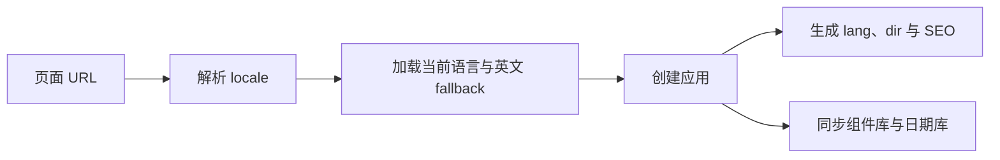

# HugeAuto 多语言实践：从 URL Locale 到 RTL 布局

## 一开始，我以为这只是一次翻译改造

HugeAuto 官网要从中英文扩展到 English、简体中文、Français 和 العربية。刚开始看，这个需求似乎就是接入 `vue-i18n`、准备四份语言包，再加一个语言切换器。

真正动手后，我才发现翻译只是最表面的一层。一个页面到底显示什么语言，同时影响 URL、SSR 首屏、接口参数、页面标题、组件库、日期格式和布局方向。如果这些地方各自判断语言，页面很容易进入一种尴尬状态：正文是法语，日期还是英文，canonical 指向另一个 URL，客户端水合时又切回了默认语言。

所以我首先要解决的不是“怎么翻译”，而是“谁有权决定当前语言”。

## 语言到底应该由谁决定

当时有三种看起来都合理的来源：

- 浏览器的 `navigator.language`
- Cookie 或 localStorage 中的用户偏好
- URL 中的 locale

浏览器语言适合第一次访问，但不适合成为页面身份。别人分享给我的可能就是一个法语链接，我的浏览器是中文，不代表网站应该擅自把我跳走。

用户偏好也有类似问题。localStorage 在服务端不可见；Cookie 虽然服务端能读，却可能让同一个 URL 根据不同用户输出不同语言。对搜索引擎和页面缓存来说，这都不是一个稳定信号。

最后我把 URL 设成唯一的首屏语言来源：

```text
/used-cars       → English
/zh/used-cars    → 简体中文
/fr/used-cars    → Français
/ar/used-cars    → العربية
```

路由最外层使用可选的 locale 段，支持列表直接来自 `LOCALES`：

```js
const LOCALES = ['en', 'zh', 'fr', 'ar']
const LOCALE_PATH = '/:locale(' + LOCALES.join('|') + ')?'
```

英文是默认语言，因此不保留 `/en` 前缀。遇到 `/en/used-cars` 时，路由守卫会把它规范化为 `/used-cars`，避免同一份英文内容存在两个可索引地址。

这个决定把后面的很多问题都简单化了：SSR 和 CSR 都只需要解析路径首段，缺少或非法 locale 时统一回退英文，不再猜测当前页面应该是哪种语言。



## 第一次切换语言时，我只改了 locale

最直接的实现是修改 `i18n.global.locale`。它确实能让大部分文案立即变化，但很快暴露出几个问题：

- 地址栏仍然是原语言 URL
- 详情页接口数据可能还是上一种语言
- canonical 和 hreflang 需要重新计算
- 某些组件在 setup 时已经读取过旧 locale
- 刷新页面后又会根据 URL 回到原语言

这说明“切换语言”不是换一套文案，而是前往当前内容的另一个语言版本。

现在的做法是使用当前 route name 重新解析目标地址，同时保留 params、query 和 hash：

```js
const target = router.resolve({
  name: route.name,
  params: { ...route.params, locale: targetLocale },
  query: route.query,
  hash: route.hash,
})

location.assign(target.href)
```

我最终选择完整页面导航，而不是继续在客户端修补所有状态。它会重新创建 i18n、head 和页面数据，URL 也重新成为所有模块的共同输入。代价是切换时会发生一次刷新，但换来的是更清晰的状态边界。

如果用户已经登录，切换器还会尝试同步账户语言。这个接口失败时仍然继续跳转，因为“当前页面能否切换”不应该依赖偏好保存是否成功。

## 要不要根据浏览器语言自动跳转

这是另一个我犹豫过的地方。自动跳转看起来更智能：中文浏览器进入英文首页，直接送到中文站就行。

但它会破坏用户对 URL 的预期，也会让分享链接和搜索引擎行为变得难以解释。最终我保留浏览器语言识别，但只把它用于客户端建议：

1. 新访客没有保存过语言偏好
2. 浏览器首选语言在支持列表内
3. 浏览器语言与当前 URL 不一致
4. 页面顶部展示一个非强制 Banner

用户可以切换，也可以关闭。两种操作都会记录选择，后续不再打扰。

我更喜欢这种做法，因为它把“页面是什么语言”和“用户可能喜欢什么语言”分开了。前者由 URL 决定，后者只提供建议。

## 阿拉伯语把多语言推进到了布局层

中、英、法语主要改变文字长度，阿拉伯语还会把阅读方向从 LTR 改为 RTL。locale 因此不能只决定 `vue-i18n` 使用哪份 JSON，还要同步页面根节点、组件库和日期格式：

```js
head.push({
  htmlAttrs: {
    lang: locale.value,
    dir: locale.value === 'ar' ? 'rtl' : 'ltr',
  },
})
```

```vue
<ConfigProvider
  :locale="antLocale"
  :direction="locale === 'ar' ? 'rtl' : 'ltr'"
>
  <router-view />
</ConfigProvider>
```

Day.js 也根据同一个 locale 动态加载语言。这样 URL 解析出的结果会沿着一条确定的链路影响文案、`lang`、`dir`、组件和日期，而不是让每个模块各自判断。

这在 SSR 下尤其重要。如果服务端先输出 `dir="ltr"`，客户端水合后再改成 `rtl`，页面会先以错误方向出现，然后整体跳动。阅读方向与文案一样，都是首屏 HTML 的一部分。

## RTL 不是把页面整体镜像

英文页面长期稳定后，样式里很容易积累 `margin-left`、`padding-right` 和 `text-align: left`。能够表达语义时，我优先改用逻辑属性：

```less
.card {
  margin-inline-start: 12px;
  padding-inline-end: 16px;
  text-align: start;
}
```

逻辑属性由浏览器根据 `dir` 解释，不需要维护两套值。不过并不是所有内容都应该翻转：返回和上一页图标通常跟随阅读方向，播放按钮、品牌 Logo 和车辆图片通常保持原样；电话、邮箱、VIN、价格和代码片段则需要局部使用 `dir="ltr"`。

手机号是很典型的例外。页面可以按照 RTL 排列，但号码本身仍然要从左到右阅读，不能反转字符串或数字顺序。号码中如果包含国际区号、空格、连字符或括号，直接继承父级的 `dir="rtl"` 还可能让 `+` 等符号跑到错误位置。

展示动态手机号时，我会用 `bdi` 把它隔离成一段独立的 LTR 内容：

```vue
<a :href="`tel:${phone}`">
  <bdi dir="ltr">{{ phone }}</bdi>
</a>
```

`dir="ltr"` 固定号码内部的阅读方向，`bdi` 则避免它影响周围的阿拉伯语文本。外层容器的对齐方式仍然可以跟随 RTL，接口值和 `tel:` 链接也保持原始号码，不对内容本身做镜像或倒序处理。

为了处理已有的大量物理属性，项目使用 `postcss-rtlcss` 的 combined 模式自动生成 LTR 与 RTL 规则。新代码仍优先使用逻辑属性，插件负责无法立即迁移的旧样式。

自动化也有明确边界。写在 Vue 模板 `style` 属性里的声明不会经过 PostCSS，因此既不会被 RTL 翻转，也不会进入项目的响应式 px 转换。需要响应语言方向或视口变化的样式必须放进 class。

## 移动端暴露了自动翻转的边界

移动端不是多语言改造的主线，却是很有效的压力测试。桌面端还能容纳的法语文案在窄屏上可能换行，阿拉伯语则同时改变方向和控件位置。更隐蔽的问题来自构建后的 CSS。

首页搜索区在桌面端使用绝对定位居中，移动端需要回到普通文档流：

```less
.page-center {
  position: absolute;
  left: 50%;
  transform: translateX(-50%);
}

@media (max-width: 480px) {
  .page-center {
    position: static;
    left: auto;
    transform: none;
  }
}
```

按源码顺序，移动端规则理应覆盖桌面端。实际却只有 `position: static` 生效，`transform: none` 被划掉。

原因是 RTL 插件会给桌面端的方向性声明生成类似 `[dir='ltr'] .page-center[data-v-xxx]` 的选择器；移动端的 `transform: none` 是对称值，不需要拆分，仍然接近 `.page-center[data-v-xxx]`。前者多了一个 `[dir]`，特异性更高，源码顺序已经无法决定结果。

最后我只为这个局部冲突补足特异性：

```less
@media @mobile-media {
  .page-center.page-center {
    position: static;
    left: auto;
    transform: none;
  }
}
```

我没有使用 `!important`，也没有在业务代码中再手写一套 `[dir]` 规则。这个问题真正留下的经验是：自动化工具改变了最终 CSS，遇到层叠异常时要先看 DevTools 中实际胜出的完整选择器，而不是只盯着 Less 源码。

## 语言包也经历了一次整理

页面变多后，早期随手添加的语言 key 开始难以维护：文件名大小写不一致、同一业务散落在多个文件、某些语言缺少对应字段。

后来我把语言资源按业务域拆分，并要求四种语言保持同样的 key 层级：

```text
src/locales/
├─ en/
│  ├─ header.json
│  ├─ home.json
│  ├─ tdk.json
│  └─ index.js
├─ zh/
├─ fr/
└─ ar/
```

应用只按需加载当前语言和英文 fallback，结果放进模块缓存；但每个 SSR 请求仍然创建自己的 i18n 实例，避免不同用户共享可变语言状态。

还有一个很小但很典型的坑：vue-i18n 会把 `|` 当作复数语法分隔符。TDK 中想显示字面量管道符时必须写成 `\\|`。这种细节单看不重要，一旦出现在四套 SEO 文案里，就会变成很难定位的运行时 warning。

## 这次改造改变了我对多语言的理解

做完之后，我不再把多语言理解成“给 `t()` 准备更多 JSON”。

真正稳定的多语言页面需要先建立一条清楚的因果链：URL 决定 locale，locale 决定语言包、页面方向和 SEO，用户偏好只影响下一次主动选择。只要链路中还有第二个模块在偷偷猜语言，SSR、水合或搜索索引迟早会出现不一致。

实际验证时，我会优先使用能代表不同风险的组合：法语检查文字扩张，阿拉伯语检查阅读方向，再把两者放到移动端观察换行、溢出和结构重排。这比只在中文桌面页面上走一遍流程更容易发现问题。

阿拉伯语也让我看到自动化的边界。工具可以加载语言包、翻转常规 CSS，却无法判断一张图片、一枚图标或一串数字在业务上是否应该改变方向。那部分仍然需要开发者理解内容本身。
