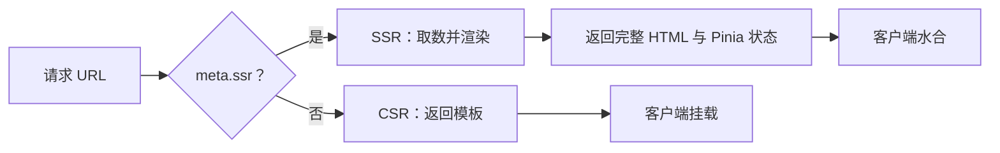

# HugeAuto 部分 SSR 与数据水合实践

## 我并不想把整个官网都改成 SSR

HugeAuto 官网同时有两类页面。

一类是首页、车源、车型和新闻，它们需要搜索引擎看到完整首屏内容；另一类是登录、聊天、支付流程和个人中心，它们更依赖浏览器能力，也没有索引价值。

最开始摆在我面前的像是一个二选一问题：继续整站 CSR，或者把所有路由都搬到 SSR。真正梳理页面后，我发现两边的代价都没有必要承担。

整站 CSR 会让动态 SEO 依赖客户端请求；整站 SSR 又会把很多纯交互页面拖进服务端执行边界。最后我决定保留同一套 Vue 应用，但让每个路由自己声明是否需要 SSR。

## 第一版目标只是“让指定页面能直出”

路由使用 `meta.ssr` 标记：

```js
{
  path: 'used-cars',
  name: 'UsedCars',
  meta: { ssr: true },
  component: () => import('./UsedCars.vue'),
}
```

服务端完成路由匹配后再读取 meta。需要 SSR 时执行 `renderToString`，否则直接返回 CSR 模板。



真正让我多花时间的不是 `renderToString`，而是 meta 的继承。嵌套路由中，父布局和子页面可能都定义 `ssr`、`auth`、`footer` 或 `noindex`。如果不同地方使用不同的判断方式，同一条路由在服务端和守卫中可能得到不同结论。

我最后统一为“最近一个显式定义的值生效”。父布局可以提供默认值，子页面也可以明确覆盖。这条规则后来同时用于 SSR、登录守卫、页脚和索引控制。

## createApp 不能分成服务端版和客户端版

SSR 改造早期最容易出现的情况，是服务端入口和客户端入口各自注册一批插件。短期能运行，页面多了以后就会发生：客户端有某个 inject，服务端没有；SSR head 使用一套 i18n，水合又创建另一套配置。

所以我把 `create-app.js` 当作唯一应用工厂。Router、Pinia、i18n、Unhead、Cookie、Services 和 Ant Design Vue StyleProvider 都从这里安装。环境差异只决定创建 `createSSRApp` 还是 `createApp`。

这让 SSR/CSR 共用成为默认行为，而不是每加一个插件都要记得在两个入口复制一次。

## 第一个真正危险的问题是跨请求状态

客户端习惯使用单例，但 Node 服务会长期处理不同用户的请求。如果 Router、Pinia、Axios 或 i18n 直接放在模块顶层，上一位用户的 Cookie、语言或 Store 就可能泄露给下一次请求。

因此每个 SSR 请求都会重新创建：

- Vue App、Router 和 Pinia
- i18n 与 Head 实例
- 携带当前请求 Cookie 的 Services
- Ant Design CSS-in-JS 缓存

业务组件不直接 import 全局 axios，而是通过 `useApi()` 或 `useServices()` 获取当前应用注入的请求实例。

这里我宁愿多创建几个对象，也不愿用复杂的清理逻辑维护服务端单例。请求级隔离的成本可预测，串用户数据的风险则完全不可接受。

## 页面直出后，又出现了重复请求

最初页面通常这样写：

```js
onServerPrefetch(fetchData)
onMounted(fetchData)
```

它解决了两个入口的问题：服务端请求时能取数，从站内客户端导航进入时也能取数。但水合阶段同时满足了两边的条件，浏览器可能再次调用同一接口。

有些页面只是多发一次请求，有些页面会先显示服务端数据，再进入 loading，最后重新显示结果，形成明显闪白。

这让我意识到，SSR 数据问题不能只解决“什么时候请求”，还要解决“客户端怎么知道服务端已经请求过”。

## useAsyncData 是从这次重复请求里长出来的

我把异步数据放进一个内部 Pinia store，并封装 `useAsyncData`：

```js
const { data, pending, error, refresh } = useAsyncData('home:banner', () => api.home.getBannerList(), {
  default: () => [],
  transform: response => response.data,
})
```

服务端预取结果随 Pinia state 一起序列化进 HTML。客户端启动时先恢复 Store，再挂载应用，因此第一次渲染可以直接使用服务端数据。

Hook 同时负责 SSR prefetch、CSR mount、状态机、响应式 key 和请求去重。页面不再手写两套生命周期。

但这个封装很快又遇到了新的问题：注水缓存应该用多久？

## “服务端取过”不等于“整个会话都缓存”

我一开始倾向于“有缓存就不请求”。这样最省接口，但列表、新闻和详情在用户站内导航回来时可能已经过期。

最后默认策略改成了“仅水合复用”：

- 服务端数据在客户端水合时使用一次
- 水合完成后，再次进入页面默认重新取数

对于汇率、地区码、车型字典等准静态数据，再显式使用 `reuseCache`：

```js
useAsyncData('global:area-code', fetchAreaCodes, {
  getCachedData: reuseCache,
})
```

车型配置页曾经在 SSR 水合后重新请求并闪白，最终就是通过明确选择跨页复用解决的。

这次取舍让我把两个概念分开了：

- 注水解决 SSR 与客户端交接
- 缓存策略解决数据在业务上能保持多久

它们碰巧使用同一个 Store，但不是同一个问题。

## 缓存 key 也比我预想得重要

有了缓存之后，key 就是数据身份，而不只是一个方便调试的名字：

```js
useAsyncData('home:banner', fetchBanner)
useAsyncData('vehicle:detail:' + vehicleId, fetchVehicle)
```

详情 ID 如果没有进入 key，第二辆车可能继续读取第一辆车的数据。相反，把分页和筛选都放进 key，又会在长会话中不断积累条目。

最后我采用“领域：实体：标识”的命名方式，并在离开动态列表时按前缀清理：

```js
onBeforeRouteLeave(() => {
  clearAsyncData(key => key.startsWith('models:list:'))
})
```

同一个 key 的并发请求还会复用同一个 Promise。这里的 inflight Map 必须放在请求级 Pinia Store 的闭包里，不能放到模块顶层，否则 SSR 请求之间又会产生共享。

## 状态码也是 SSR 的职责

当详情接口返回空数据时，只渲染一个“未找到”组件并不够。如果响应仍然是 200，搜索引擎会把它当成软 404。

我没有让页面直接修改 SSR context，而是增加两个很薄的 Hook：

```js
if (!detail) ssrError(404)
if (detail.permanentlyRemoved) ssrError(410)
if (legacySlug) ssrRedirect(newLocation, 301)
```

`useSSRError` 负责 4xx/5xx，`useSSRRedirect` 负责 3xx；CSR 环境下它们都是 no-op。页面只表达资源状态，不接触服务器响应对象。

这个边界后来很有用，因为“如何写响应”属于渲染框架，“资源是否永久删除”属于业务页面。

## 还有一些代码，我选择不让它运行在服务端

SSR 改造进行到后面，很容易产生一个错误目标：让所有代码都能在 Node 中执行。

我没有这样做。依赖 `window`、`document`、localStorage 或 DOM 尺寸的逻辑仍然留在 `onMounted`；纯客户端 UI 使用 `ClientOnly`；Cookie 则通过同构的 `useCookies()` 访问。

判断标准不是“服务端会不会报错”，而是“它是否参与首屏可索引内容，以及服务端与客户端第一次渲染能否得到同样的 DOM”。

有些 VueUse composable 在服务端会安全返回默认值，但如果这个默认值决定了 DOM 结构，客户端读到真实值时依然会水合不一致。安全 no-op 和适合 SSR 不是一回事。

## 最后得到的不是一个 SSR 项目

回头看，这套方案更像是在现有 Vue 应用上增加了一条可选择的服务端渲染路径。

公开内容页承担 SSR 的复杂度，登录和重交互页面继续保持 CSR；`createApp` 保证两端使用同一套插件，`useAsyncData` 负责数据交接，路由 meta 和 SSR Hook 则表达渲染与 HTTP 语义。

我认为最有价值的并不是“部分 SSR”这个名字，而是把几个经常混在一起的问题拆开了：是否需要服务端 HTML、数据如何注水、数据应该缓存多久、资源不存在时返回什么状态。只有把它们分开，页面才能按自己的真实需求做选择。
