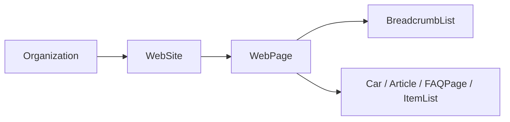

# HugeAuto SEO 工程化：从 TDK 到结构化数据

## 我最先遇到的不是“缺少 meta”

整理 HugeAuto 官网 SEO 时，表面问题很多：有的页面没有 canonical，有的页面只补了英文 TDK，详情页的标题要等客户端接口回来后才完整，结构化数据又分别出现在插件、布局和页面里。

如果逐页补标签，每一个问题都不难。但我很快发现，真正麻烦的是这些标签之间没有共同规则。路由改名后 TDK 可能失效；新增阿拉伯语后 hreflang 仍然只有三种；一个详情页甚至可能同时存在多段不知道由谁维护的 JSON-LD。

所以我没有继续补页面，而是先尝试回答一个问题：**一个可索引页面，最少需要提供哪些事实，剩下的能不能由统一工具生成？**

## 第一步是给页面确定身份

最后我选择用 route name 作为页面的 SEO 身份：

```text
tdk.<routeName>.title
tdk.<routeName>.description
tdk.<routeName>.keywords
```

例如路由叫 `UsedCar`，四套 `tdk.json` 都必须存在 `tdk.UsedCar`。页面只提供动态变量，品牌后缀由全局 titleTemplate 统一拼接。

这个规则有些严格：路由 name 一旦变化，语言资源必须同步。可它也把原本隐性的关系变成了可检查的约定。新增页面时，不再需要到处寻找“这个 title 到底写在哪”。

静态页只需调用：

```js
usePageSeo()
```

动态页则提供 getter：

```js
const seoVars = () => ({
  modelName: detail.modelName || '',
  modelYear: detail.modelYear || '',
})

usePageSeo({ vars: seoVars })
```

我使用 getter 而不是 setup 时生成一次普通对象，因为接口数据回来后，head 也需要跟着更新。

## canonical 被查询参数搞复杂了

详情页有两种 URL 形式。一种把资源标识放在 path 中，另一种仍然通过 query 区分资源，例如：

```text
/car-news-details?id=1001&utm_source=share&page=2
```

最初如果直接复制当前 query，canonical 会带上分享来源、分页和临时筛选条件。同一篇新闻可能因此出现很多“权威地址”。

我没有维护一份需要删除的参数黑名单，而是让页面声明真正用于识别内容的白名单：

```js
usePageSeo({ queryKeys: ['id'] })
```

最终 canonical 只保留 `id`。同一套白名单也用于生成其他语言的 alternate URL。

这个选择看起来只是少写几个参数，实际上是在明确页面身份：如果去掉某个 query 后内容没有变化，它通常就不应该出现在 canonical 中。

## 多语言 URL 不再由页面手写

有了 route name、params 和必要 query 后，`usePageSeo` 可以让 Router 重新解析每一种语言的地址：

```html
<link rel="canonical" href="https://example.com/fr/used-cars" />
<link rel="alternate" hreflang="x-default" href="https://example.com/used-cars" />
<link rel="alternate" hreflang="en" href="https://example.com/used-cars" />
<link rel="alternate" hreflang="zh" href="https://example.com/zh/used-cars" />
<link rel="alternate" hreflang="fr" href="https://example.com/fr/used-cars" />
<link rel="alternate" hreflang="ar" href="https://example.com/ar/used-cars" />
```

英文默认不带前缀，`x-default` 也指向英文页面。这里最重要的不是少写几行 HTML，而是 hreflang 开始和真实路由使用同一份语言列表与参数规则。

## 动态 SEO 迫使我正视 SSR 取数顺序

车源、车型和新闻页面的 title、description、分享图和结构化数据都依赖接口。如果只在客户端更新 head，浏览器里看起来完全正常，但服务端返回的 HTML 仍然可能是空标题或默认文案。

最后我把动态 SEO 的顺序固定下来：

```text
匹配路由
  → 服务端获取首屏数据
  → 更新响应式状态
  → 计算 TDK、分享信息和结构化数据
  → renderToString
```

这也是为什么 SEO 不能只看 `usePageSeo`。它真正依赖的是 SSR 数据链路。如果动态数据没有在 `onServerPrefetch` 或 `useAsyncData` 中完成，Hook 再完整也只能生成空内容。

## 结构化数据一度比 meta 更难维护

结构化数据最初分散在多个位置：站点插件负责 Organization，布局负责面包屑，详情页再添加 Car 或 Article。每一段单独看都合理，合在一起却可能出现重复节点、不同的站点信息和多个互不关联的 JSON-LD。

我最后做的决定是：全站只允许 `usePageSeo` 输出一个 schema.org `@graph`。



基础节点由 Hook 生成，页面只贡献业务节点：

```js
usePageSeo({
  schema: () => ({
    breadcrumb: breadcrumbList.value,
    article: buildArticle(detail),
  }),
})
```

各节点通过 `@id` 互相引用。可见面包屑和 BreadcrumbList 使用同一份配置，避免页面展示 `Home > News > Detail`，结构化数据却只有 `Home > Detail`。

这次收口也让我明确了一条边界：通用 Hook 负责图谱关系，Car、Article、FAQPage 等字段整理留在业务 helper 中。否则一个 SEO Hook 很快会变成所有页面数据清洗逻辑的集合。

## 我开始主动少写一些结构化字段

做结构化数据时，很容易产生“字段越完整越好”的错觉。但后端没有可靠数据时，补默认值其实是在制造错误事实。

项目里最后采用了更保守的做法：

- 新闻日期无法解析时，不输出 `datePublished`
- 静态页面不使用当前时间伪装内容更新
- 没有可靠营业时间和经纬度时，不补 LocalBusiness 字段
- 没有有效列表项时，整个 ItemList 节点跳过
- 详情接口失败时，不输出一个空的 Car 或 Article

分享图也做了区分。品牌默认图可以作为 `og:image` 兜底，但只有页面显式提供的真实主图，才会成为 `WebPage.primaryImageOfPage`。否则每个页面都会声称同一张品牌图是自己的主要内容图片。

## 最让我改变方案的是软 404

项目曾经把失效详情页 301 到一个错误展示页。用户看到的结果似乎没问题，但搜索引擎收到的语义非常奇怪：原 URL 被永久迁移，目标页却没有对应资源。

后来我把“用户看到什么”和“HTTP 响应是什么”分开处理：

| 资源状态                   | 最终选择 |
| -------------------------- | -------- |
| URL 根本不存在             | 404      |
| 数据暂时缺失、未来可能恢复 | 404      |
| 商品确定永久删除           | 410      |
| 老 URL 有明确的新地址      | 301      |
| 临时跳转                   | 302      |

服务端仍然可以渲染完整的错误说明页，但响应状态必须准确。尤其是 410，它不是“更严重的 404”，而是在明确告诉爬虫这个资源不会回来。

为了避免页面直接操作底层 SSR context，我把错误状态和重定向分别封装成 `useSSRError` 与 `useSSRRedirect`。CSR 下它们不做任何事，页面可以在服务端预取逻辑中直接表达资源语义。

## noindex 和 robots 也应该进入同一套规则

登录、支付和个人中心页面没有索引价值。它们通过 route meta 声明 `noindex`，应用统一输出 `noindex, nofollow`，SEO Hook 同时停止生成 canonical、hreflang 和 JSON-LD。

环境层面则在构建后生成不同的 `robots.txt`：测试和 UAT 全站禁止抓取，生产环境才开放公开页面并声明 sitemap。

我不想依靠“上线前记得改一下 robots”这种流程。能由构建环境确定的事情，就不应该继续交给人工记忆。

## 现在我怎么理解官网 SEO

这次整理之后，我不再把 SEO 看成页面开发结束后的标签补丁。

对动态多语言网站来说，SEO 更接近一份页面协议：路由定义身份，i18n 提供内容，SSR 保证首屏事实完整，Hook 生成 canonical、alternate、分享信息和结构化图谱，HTTP 状态码表达资源是否存在。

统一出口并没有消灭复杂度，它只是让复杂度有了边界。页面开发者仍然要判断哪些 query 真正标识内容、哪些日期可信、资源消失后应该返回什么状态；但不再需要每个人重新拼一遍 head 标签。
